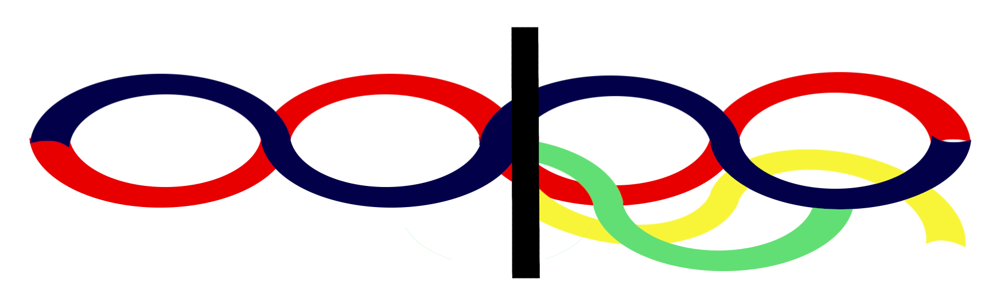

# Preempt Cordon - design
> "A fediverse site for having arguments on the internet, without spending all your time having arguments on the internet"

(logo feedback appreciated)

Preempt Cordon is a wiki-like software that allows groups of fediverse users to contribute to choices and vote in complex ways to trigger actions (API calls).

It allows you to log off using Liquid Democracy, the optional delegation of your vote, and several deadlock preventing vote types. Each vote type selected focused on allowing positive deviance, healthy disent, and constructive feedback.

Game theory wise, RCV benefits in politeness over FPTP because of duverger's law (the mathematical reason behind entrenched 2 party systems) - it gives you an incentive to offer polite alternatives. Notwithstanding tactical voting, it also offers a solution to splintered/abandoned open source projects.

This software is intended to allow collaborations and coalitions to be more fluid or serendipitous, and less entrenched as in-groups.

Persons moderating this software should focus on encouraging healthy and constructive disagreement, allowing reservations of quieter members to be discussed (instead of falling into collective illusions or abiline's paradox).

It allows for four different vote types:
- ranked choice voting: majority compromise, good for limited time/resources, enough to consent, not necessarily agree
- concensus democracy: near unanimus / minority protection, good for core values, takes time, enough to not block
- threshold votes: four-eyes configuration systems
- lazy concensus: (+1 volunteering, +0 won't help, -0 no alternative, -1 volunteering alternative)

You may chain vote types or add reactions to switch between different vote types as needed.

it introduces the following new concepts to the standard UX:
- `@@roles`, collections of users attached to an ACL. Commonly groups.
	- roles within the system include:
		- Group representatives (picked by the group)
		- Facilitators (choice/decision/criteria/argument curators)
		- Debaters (choice/decision/criteria/argument editors)
		- Voters (make selections)
		- Observers (react/pin posts)
		- Topic curators (approve tagging)
		- Moderators (administer groups)
		- Site Moderators (respond when other teams fail)
- `#topic@@roles`, managed, rich reactions, taggable to articles upon approval by both the facilitator and the topic curator
	- argument-feedback tags (structure, evidence)
	- moderation tags (facism, trolling, content warning)
	- subject (polysemy)
	- legal (site mod) tags
- delegation, a virtual vote group a user can use to auto-select their preference
	- users can delegate per group, topic, choice, or decision, this acts as a virtual monitor / configurable choice
	- when the monitor hasn't made a decision, it emails the user to vote manually
- Wiki articles & sections (assignable to different groups) - basically posts, indexable by title.
	- Topics are articles, as are choices, decisions, criteria, arguments, actions, users, groups, roles...
	- articles are Markdown, CC-BY-SA,
	- contributing an edit with many links rate-limits a user
	- articles live on a particular server, but are transferable
	- articles can have is-a relationships, as well as parent/child
- choices, templates or workflows for how a decision can be raised, who by, and what actions it can plug into
	- enable or disable specific actions
	- decide the role boundaries
	- decide the vote boundaries
	- explain the choice type and requirements for the choice
	- decide what choice templates can follow it
	- enable or disable delegation (usually disabled for volunteering-style votes)
- decisions, managed by a facilitator role, that resolve to actions at a due date
	- wiki of the decision explains it, debaters contribute sections of the wiki and pluggable API options to choose from
	- monitors trigger the final decision
- options, pluggable changes to a system, containing an overview by the proposer (debater)
	- option-metapackages are possible using monitors in a circuit-breaker pattern (e.g., bill requires X,Y,Z, fallback bill 2)
- criteria, facets with which to compare different options, proposed by debater
	- depending on the community these could be very practical prompts or very philisophical ones
- arguments, descriptions of each option based on criteria, given by each debater
	- generally how each person answers the question, e.g. 1: "I think 1.A is x, 2.A is y, 3.A is z"
- selections, voter choices
	- not karma affecting, but also not cryptographically protected
	- visibility set by voter
- reactions, tags by observers to a vote regarding the options, arguments, moderator/facilitator's job
	- see topics above
	- monitors on these actions don't have a due date (they're live)
	- monitors for health reactions are meant for temporary soft actions (downranking, delisting, rate limiting), not permanent decisions (santa clara transparency principles)
- monitors, the functions that notify users when delegation fails, notify mods when something is unhealthy, or trigger actions when voting has concluded
- regions are groups that share a conflicting #topic (#topic@@A & #topic@@B are in the same region). Their moderation teams might not agree. This focuses on filter bubbles and is out of scope.
	- whether a group participates in a region is up to that group
	- tools to protect two groups from fighting too much need to be built
	- user-controlled algorithms that find neutral folks you neither agree or disagree with (discovery via reactions) might be helpful (or pandora's box)
- Karma is a sliding window of gradually forgiven, not deletable or washable, reputation based on observer reactions to supplied content. This focuses on iterated prisoner's dilemma and makes regions safer. Selections do not affect karma, contributions to wikis do.

Mod actions like suspending a user are exposed as Decisions, and meta-moderation (appealing a ban, or reporting an unresponsive mod) are also flows. You could technically build a LERS (Law Enforcement Request System) / GDPR workflow with transparency into the decision flow, or various kinds of meta-moderation or representative recall.

Even follow-requests, chat-requests, or group join requests could be choice templates that create decisions. 

Long term this is intended to break in-group/out-group problems, like Pernicious Polarization (where political cleavages solidify instead of being fluid coalitions based on the options proposed).
